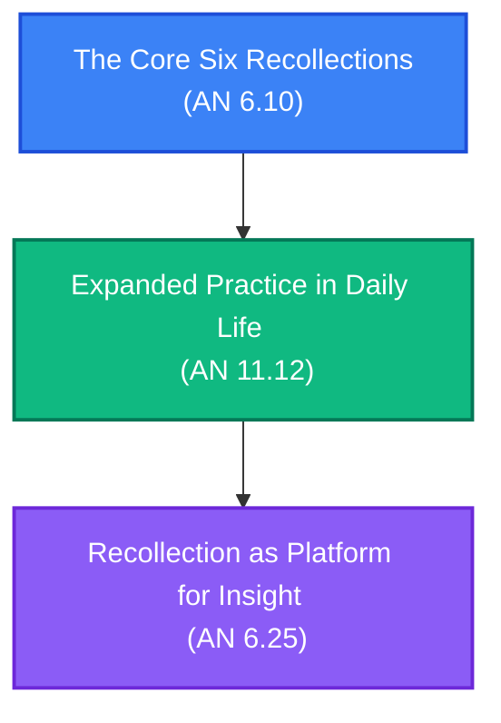

# Anussati Practice: Six Recollections Path

**Navigation**: [[INDEX|Pali Canon Vault]] / [[paths/INDEX|Reading Paths]]

> [!NOTE]
> The six recollections (*anussati*)—recollection of the Buddha, Dhamma, Saṅgha, virtue (*sīla*), generosity (*cāga*), and devas—are highly effective lay practices for calming the mind, gladdening the heart, and overcoming fear and anxiety in daily life.

---

## The Path Map

---

## 1. Introduction: The Six Recollections
The core instruction on how lay disciples can establish recollection.

*   **[[an6_10|AN 6.10: Mahānāmasutta]]**  
    *Practice Focus*: The Buddha instructs Mahānāma on the six recollections. He explains that when a noble disciple recollected the qualities of the Buddha, Dhamma, Saṅgha, their own virtue, their own generosity, or the qualities of faith/wisdom that lead to heavenly rebirth, their mind is not obsessed by greed, anger, or delusion. Their mind is straight, gladdened, and enters concentration.  
    *Commentaries*: [[an6_10_att|Commentary]] · [[an6_10_tik|Sub-commentary]]

---

## 2. Integration: Lay Life and Constant Practice
Expanding the recollections into the busy environments of householders.

*   **[[an11_12|AN 11.12: Mahānāmasutta]]**  
    *Practice Focus*: Mahānāma asks how a lay disciple should live who has already understood the teachings, while living in a crowded, busy home. The Buddha details how to maintain these recollections constantly, even while surrounded by family and household duties.  
    *Commentaries*: [[an11_12_att|Commentary]] · [[an11_12_tik|Sub-commentary]]

---

## 3. Depth: Recollections for Ending the Taints
Using these recollections as a direct support for concentration and liberation.

*   **[[an6_25|AN 6.25: Anussatiṭṭhānasutta]]**  
    *Practice Focus*: The Buddha lists the recollections as topics of meditation (*anussatiṭṭhānāni*) that should be developed, leading to the eradication of taints and the realization of final release.  
    *Commentaries*: [[an6_25_att|Commentary]] · [[an6_25_tik|Sub-commentary]]

---

> [!TIP]
> For a detailed breakdown of the qualities of the Triple Gem and the other recollections, see the [[six_recollections|Six Recollections Mātikā]].
