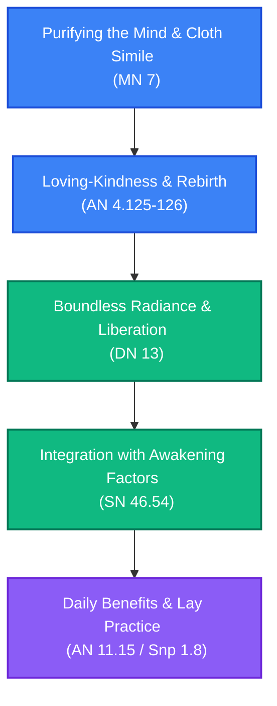

# Brahmavihāra Cultivation: Sublime States Path

**Navigation**: [[INDEX|Pali Canon Vault]] / [[paths/INDEX|Reading Paths]]

> [!NOTE]
> The four sublime states (*brahmavihāras*)—loving-kindness (*mettā*), compassion (*karuṇā*), altruistic joy (*muditā*), and equanimity (*upekkhā*)—serve as both powerful concentration exercises and a primary method for cultivating a boundless heart.

---

## The Path Map

---

## 1. Purification: Simile of the Cloth
Purifying the mind of taints to prepare the soil for boundless goodwill.

*   **[[mn7|MN 7: Vatthūpamasutta]]**  
    *Practice Focus*: The cloth simile. The Buddha warns that a dirty cloth cannot take dye well, just as a dirty mind cannot progress. He lists the mental defilements, explains how to abandon them, and details the radiation of loving-kindness, compassion, joy, and equanimity.  
    *Commentaries*: [[mn7_att|Commentary]] · [[mn7_tik|Sub-commentary]]

---

## 2. Foundation: Rebirth and Masterful Development
Developing loving-kindness systematically and understanding its cosmic results.

*   **[[an4_123_126|AN 4.125–126: Mettāsutta]]**  
    *Practice Focus*: Developing loving-kindness, compassion, joy, and equanimity, and how these practices correspond to rebirth in the Brahma realms. Crucially, the Buddha contrasts the path of the ordinary person with that of an educated noble disciple who practices these states alongside insight.  
    *Commentaries*: [[an4_123_126_att|Commentary]] · [[an4_123_126_tik|Sub-commentary]]

---

## 3. Radiance: The Path to Brahma
Radiating the sublime states in all directions to dissolve anger and ill-will.

*   **[[dn13|DN 13: Tevijjasutta]]**  
    *Practice Focus*: The Buddha teaches two young brahmins the true path to companionship with Brahmā: the cultivation of boundless loving-kindness, compassion, altruistic joy, and equanimity, radiating them to the front, back, left, right, above, and below.  
    *Commentaries*: [[dn13_att|Commentary]] · [[dn13_tik|Sub-commentary]]

---

## 4. Integration: Combining with the Awakening Factors
Synthesizing boundless heart practices with the seven factors of awakening.

*   **[[sn46|SN 46.54: Mettāsahagatasutta]]**  
    *Practice Focus*: How to practice loving-kindness, compassion, altruistic joy, and equanimity in conjunction with the seven factors of awakening (*bojjhaṅgas*), culminating in final liberation.  
    *Commentaries*: [[sn46_att|Commentary]] · [[sn46_tik|Sub-commentary]]

---

## 5. Practicality: Benefits and Everyday Practice
The everyday fruits of metta and the classic protection text.

*   **[[an11_15|AN 11.15: Mettānisaṃsasutta]]**  
    *Practice Focus*: The eleven benefits of practicing loving-kindness, including sleeping in comfort, waking in comfort, being dear to humans and non-humans, quick concentration, and a peaceful death.  
    *Commentaries*: [[an11_15_att|Commentary]] · [[an11_15_tik|Sub-commentary]]
*   **[[snp1_8|Snp 1.8: Karaṇīyamettasutta]]**  
    *Practice Focus*: The classic discourse on loving-kindness. Instructions on how to act, cultivate boundless goodwill for all living beings, and guard this mind as a mother guards her only child.  
    *Commentaries*: [[snp1_8_att|Commentary]]

---

> [!TIP]
> For a detailed list of all sublime states canonical references, see the [[four_sublime_states|Four Sublime States Mātikā]].
