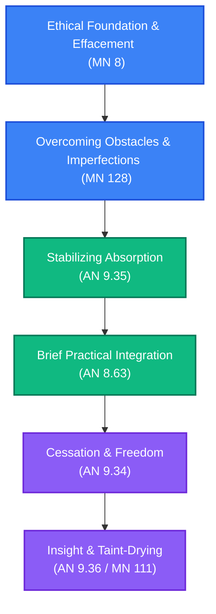

# Entering Jhāna: Meditative Absorption Path

**Navigation**: [[INDEX|Pali Canon Vault]] / [[paths/INDEX|Reading Paths]]

> [!NOTE]
> This reading path is structured systematically to help practitioners move from the ethical foundations of concentration through identifying mental obstacles, stabilizing concentration, and finally using absorption as a vehicle for liberating insight.

---

## The Path Map

---

## 1. Foundation: Ethical Effacement
Before attempting deep concentration, the mind must be freed from coarse defilements and remorse.

*   **[[mn8|MN 8: Sallekhasutta]]**  
    *Practice Focus*: Self-effacement (*sallekha*) rather than mere meditative attainment. The Buddha explains that the jhānas are peaceful abidings (*diṭṭhadhammasukhavihāra*), but true effacement is the clearing away of ill-will, pride, and views.  
    *Commentaries*: [[mn8_att|Commentary]] · [[mn8_tik|Sub-commentary]]

---

## 2. Obstacles: Mental Imperfections
Recognizing the subtle hindrances that arise as concentration begins to deepen.

*   **[[mn128|MN 128: Upakkilesasutta]]**  
    *Practice Focus*: Overcoming the eleven subtle mental imperfections (*upakkilesas*) that cause the meditative light and vision of forms to disappear. A must-read for anyone encountering nimittas or fluctuations in light.  
    *Commentaries*: [[mn128_att|Commentary]] · [[mn128_tik|Sub-commentary]]

---

## 3. Stabilization: Stabilizing the Absorption
Understanding the step-by-step stabilization required before progressing to higher states.

*   **[[an9_35|AN 9.35: Gāvīupamāsutta]]**  
    *Practice Focus*: The cow simile. The Buddha warns against moving to a higher jhāna before completely mastering and stabilizing the current one, just as a foolish mountain cow loses her footing when trying to graze on unfamiliar slopes.  
    *Commentaries*: [[an9_35_att|Commentary]] · [[an9_35_tik|Sub-commentary]]

---

## 4. Application: Brief Practical Instructions
Integrating concentration with daily practice and other domains.

*   **[[an8_63|AN 8.63: Saṅkhittasutta]]**  
    *Practice Focus*: Brief instructions on establishing the jhānas based on the brahmavihāras (mettā, etc.) and combining them with the four foundations of mindfulness.  
    *Commentaries*: [[an8_63_att|Commentary]] · [[an8_63_tik|Sub-commentary]]

---

## 5. Liberation: Cessation and Final Peace
Using concentration to touch the ultimate peace of Nibbāna.

*   **[[an9_34|AN 9.34: Nibbānasukhasutta]]**  
    *Practice Focus*: Sāriputta explains how Nibbāna is pleasant precisely because there is "nothing felt" (*avedayitasukha*), tracing the progressive cessation of feeling and perception through the jhānas.  
    *Commentaries*: [[an9_34_att|Commentary]] · [[an9_34_tik|Sub-commentary]]
*   **[[an9_36|AN 9.36: Jhānasutta]]**  
    *Practice Focus*: Using each of the four jhānas and first three formless attainments as a platform for analyzing the five aggregates, leading to the destruction of the taints.  
    *Commentaries*: [[an9_36_att|Commentary]] · [[an9_36_tik|Sub-commentary]]

---

> [!TIP]
> For a detailed list of all canonical references, see the [[four_jhanas|Four Jhānas Mātikā]].
