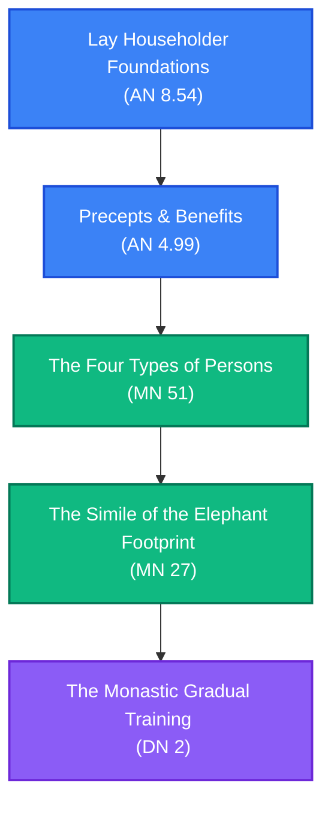

# Gradual Training: Step-by-Step Path

**Navigation**: [[INDEX|Pali Canon Vault]] / [[paths/INDEX|Reading Paths]]

> [!NOTE]
> The gradual training (*anupubbasikkhā*) describes the step-by-step development of a practitioner, from householder morality and generosity, through sensory restraint and contentment, to absorption and final insight.

---

## The Path Map

---

## 1. Lay Foundation: Householder Success and Happiness
Virtues that bring happiness in this life and the next for householders.

*   **[[an8_54|AN 8.54: Dīghajāṇusutta]]**  
    *Practice Focus*: The Buddha instructs Dīghajāṇu on the householder's gradual path: accomplishment in initiative, protection, good friendship, and balanced living (*sama-jīvitā*), leading to happiness in this life, and faith, virtue, generosity, and wisdom leading to happiness in future lives.  
    *Commentaries*: [[an8_54_att|Commentary]] · [[an8_54_tik|Sub-commentary]]
*   **[[an4_99|AN 4.99: Sikkhāpadasutta]]**  
    *Practice Focus*: Contemplating ethical training. The Buddha explains the four types of practitioners based on whether they practice for their own benefit, others' benefit, neither, or both. Taking up precepts benefits both oneself and others.  
    *Commentaries*: [[an4_99_att|Commentary]] · [[an4_99_tik|Sub-commentary]]

---

## 2. Distinction: Four Types of Persons
Understanding the true nature of practice: not tormenting oneself or others.

*   **[[mn51|MN 51: Kandarakasutta]]**  
    *Practice Focus*: The four types of persons: those who torment themselves (ascetics), those who torment others (slaughterers, tyrants), those who torment both, and those who torment neither (the practitioner of the gradual training who lives in peace).  
    *Commentaries*: [[mn51_att|Commentary]] · [[mn51_tik|Sub-commentary]]

---

## 3. Progression: The Footprint of the Tathāgata
Detailing the steps of monastic training and sensory restraint.

*   **[[mn27|MN 27: Cūḷahatthipadopamasutta]]**  
    *Practice Focus*: The gradual training described as the "elephant's footprint." The Buddha details the steps from hearing the Dhamma, leaving household life, practicing virtue, guarding the sense doors, mindfulness, contentment, abandoning the hindrances, entering the jhānas, and attaining the three knowledges.  
    *Commentaries*: [[mn27_att|Commentary]] · [[mn27_tik|Sub-commentary]]

---

## 4. Culmination: The Monastic Fruits
The classic, fully-expanded canonical gradual training.

*   **[[dn2|DN 2: Sāmaññaphalasutta]]**  
    *Practice Focus*: The classic gradual training sutta. The Buddha outlines for King Ajātasattu the visible fruits of the ascetic life, describing every step of the gradual training with beautiful, memorable similes.  
    *Commentaries*: [[dn2_att|Commentary]] · [[dn2_tik|Sub-commentary]]

---

> [!TIP]
> For a structured list of these elements, see the [[matika/gradual_training|Gradual Training Mātikā]].
