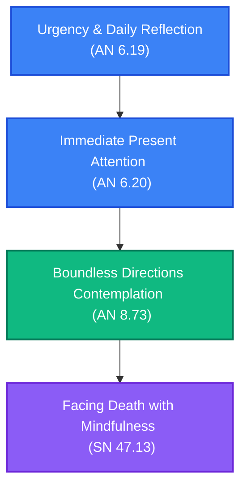

# Maraṇasati Practice: Death Contemplation Path

**Navigation**: [[INDEX|Pali Canon Vault]] / [[paths/INDEX|Reading Paths]]

> [!NOTE]
> Mindfulness of death (*maraṇasati*) is not a morbid preoccupation, but a powerful practice for generating spiritual urgency (*saṃvega*), breaking down attachments, and preparing the mind to meet its final moments with clarity and peace.

---

## The Path Map

---

## 1. Urgency: The First Steps of Contemplation
Understanding why death must be recollected and how to arouse energy.

*   **[[an6_19|AN 6.19: Paṭhamamaraṇassatisutta]]**  
    *Practice Focus*: The Buddha explains that mindfulness of death, when developed, is of great fruit and benefit. He points out that merely contemplating "I might live for a day and a night" is negligent. True mindfulness of death is practicing with the urgency that one might not live even for the time it takes to chew a single mouthful of food.  
    *Commentaries*: [[an6_19_att|Commentary]] · [[an6_19_tik|Sub-commentary]]

---

## 2. Examination: Daily Review
Examining the heart for unskilful qualities that would cause regret at death.

*   **[[an6_20|AN 6.20: Dutiyamaraṇassatisutta]]**  
    *Practice Focus*: The Buddha instructs the practitioner to review their mind at evening and morning: "Are there any evil, unskilful qualities in me that would cause me harm if I die tonight?" If so, one should use intense effort to abandon them, just as one would put out a fire in one's turban.  
    *Commentaries*: [[an6_20_att|Commentary]] · [[an6_20_tik|Sub-commentary]]

---

## 3. Scope: The Boundless Contemplation
Contemplating the inevitability of death from all directions.

*   **[[an8_73|AN 8.73: Paṭhamamaraṇassatisutta]]**  
    *Practice Focus*: The Buddha instructs the monks to contemplate death as approaching from the eight directions, reminding them of the impermanence of all formations.  
    *Commentaries*: [[an8_73_att|Commentary]] · [[an8_73_tik|Sub-commentary]]

---

## 4. Application: Meeting the End Mindfully
Facing the death of a beloved teacher and preparing for one's own departure.

*   **[[sn47|SN 47.13: Cundasutta]]**  
    *Practice Focus*: Cunda and Ānanda are grieved by the parinibbāna of Sāriputta. The Buddha comforts them, reminding them that Sāriputta did not take away the virtue, concentration, wisdom, or liberation of the Saṅgha when he died. He urges them to "live as islands to yourselves, with the Dhamma as your island."  
    *Commentaries*: [[sn47_att|Commentary]] · [[sn47_tik|Sub-commentary]]

---

> [!TIP]
> For body-based mortality contemplations, see [[mn119|MN 119: Kāyagatāsatisutta]] and the cemetery contemplations in [[mn10|MN 10: Satipaṭṭhānasutta]].
