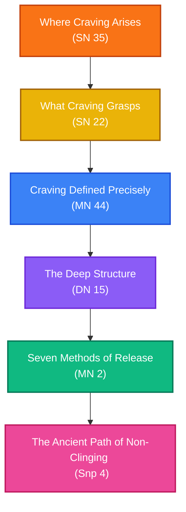

# Understanding Craving (Taṇhā)

**Navigation**: [[INDEX|Pali Canon Vault]] / [[paths/INDEX|Reading Paths]]

> [!NOTE]
> Craving (*taṇhā*) is the second noble truth — the origin of suffering — yet the canon is careful not to reduce it to a single thing. It arises through sense contact (*phassa*), feeds on feeling (*vedanā*), and clings to form, sensation, mental formations, and consciousness. Understanding craving means tracing *where* it arises (the six sense doors), *what* it grasps (the five aggregates), *how* it perpetuates itself (dependent origination), and *how* it is released (the seven methods and the way of non-clinging). This path moves from the surface inward.

---

## The Path Map

---

## 1. Where Craving Arises: The Six Sense Doors

Before understanding craving's structure, the practitioner must see precisely *where* it enters. The canon's answer is unambiguous: at the meeting of sense organ, sense object, and consciousness — at the six sense doors.

*   **[[sn35|SN 35: Saḷāyatanasaṃyutta]]**  
    *Practice Focus*: The Saḷāyatanasaṃyutta exhaustively maps how contact (*phassa*) at the six sense bases — eye, ear, nose, tongue, body, mind — gives rise to feeling, which gives rise to craving. The fires of passion, aversion, and delusion burn at the point of sense contact. Several suttas in this collection describe "restraint of the sense faculties" (*indriyasaṃvara*) as the first-line practice for not feeding craving at its source.  
    *Commentaries*: [[sn35_att|Commentary]] · [[sn35_tik|Sub-commentary]]

---

## 2. What Craving Grasps: The Five Aggregates

Once craving arises through sense contact, it clings to *something* — and the canon names these objects precisely: form, feeling, perception, mental formations, and consciousness. Understanding the aggregates (*khandhas*) as impermanent, suffering, and non-self removes the ground craving needs to stand on.

*   **[[sn22|SN 22: Khandhasaṃyutta]]**  
    *Practice Focus*: The Khandhasaṃyutta surveys the five aggregates from every angle. Craving (*taṇhā*) for form, for feeling, for perception, for formations, for consciousness is directly named. A practitioner who sees each aggregate as "not mine, not I, not my self" (*n'etaṃ mama, n'eso'ham asmi, na m'eso attā*) loosens craving's grip at the level of what it clings to.  
    *Commentaries*: [[sn22_att|Commentary]] · [[sn22_tik|Sub-commentary]]

---

## 3. Craving Defined Precisely: A Precise Analysis

The Cūḷavedallasutta is one of the canon's most analytically precise texts. Dhammadinnā gives exact definitions of craving, clinging, the cessation of clinging, and the path to its cessation — in a concise exchange that repays careful, slow reading.

*   **[[mn44|MN 44: Cūḷavedallasutta]]**  
    *Practice Focus*: Dhammadinnā explains that craving (*taṇhā*) is the "fettering bond" in the context of feeling — sensing something pleasant, craving follows. She then defines the four kinds of clinging (*upādāna*): to sensual pleasures, to views, to rules and vows, and to a doctrine of self. The cessation of clinging is simply the cessation of craving — the same path that leads to nibbāna.  
    *Commentaries*: [[mn44_att|Commentary]] · [[mn44_tik|Sub-commentary]]

---

## 4. The Deep Structure: Craving in Dependent Origination

The Mahānidānasutta gives the most detailed canonical treatment of dependent origination (*paṭiccasamuppāda*). Here, the link between feeling and craving — the pivot of the whole chain — is laid out with a depth rarely found elsewhere.

*   **[[dn15|DN 15: Mahānidānasutta]]**  
    *Practice Focus*: The Buddha explains that just as craving arises from feeling, name-and-form (*nāmarūpa*) arises from consciousness, and consciousness from name-and-form — they are mutually co-dependent. The sutta then describes the "seven stations of consciousness" and the ways beings cling to becoming. The famous dialogue about a "self" concludes by showing how, with the cessation of craving, neither grasping nor becoming nor birth nor death arise. Read slowly: one link at a time.  
    *Commentaries*: [[dn15_att|Commentary]] · [[dn15_tik|Sub-commentary]]

---

## 5. Seven Methods of Release: Not Feeding What You Have Not Yet Fed

The Sabbāsavasutta provides the most practical framework for working with craving: seven methods classified by the *type of attention* required to remove a taint. Not all craving needs to be fought; some is better abandoned by *not attending* at all.

*   **[[mn2|MN 2: Sabbāsavasutta]]**  
    *Practice Focus*: The seven methods — by seeing (*dassana*), restraint (*saṃvara*), using (*paṭisevana*), enduring (*adhivāsana*), avoiding (*parivajjana*), removing (*vinodana*), and developing (*bhāvanā*) — classify the specific causes of craving and the corresponding response. Many "problems" are not things to eliminate but things never to attend to in the first place. The commentary is particularly helpful here.  
    *Commentaries*: [[mn2_att|Commentary]] · [[mn2_tik|Sub-commentary]]

---

## 6. The Ancient Path: Non-Clinging to Views and Sense Pleasures

The Aṭṭhakavagga (Chapter 4 of the Sutta Nipāta) is among the oldest strata of the Pali canon. These sixteen poems address craving at its most refined level: not just sensual craving, but clinging to views, to identity, to the idea of what practice should produce. The language is terse and the instruction radical.

*   **[[snp4_1|Snp 4.1]] – [[snp4_16|Snp 4.16]]: Aṭṭhakavagga**  
    *Practice Focus*: The Aṭṭhakavagga returns again and again to the theme of the "one who does not grasp" (*ādānaṃ na gaṇhāti*) — who has put down the burden, who is not caught in disputes about views, who does not define themselves by their attainments. Particularly worth reading in sequence: Snp 4.1 (sense pleasures), 4.5 (the burden), 4.9 (Māgandiyasutta — on not clinging to views even of the Dhamma), 4.14 (non-involvement), 4.15 (the hasty monk who clings to rules), and 4.16 (Sāriputta's non-clinging).  
    *Commentaries*: [[snp4_1_att|Commentary (4.1)]] · [[snp4_9_att|Commentary (4.9)]] · [[snp4_16_att|Commentary (4.16)]]

---

> [!TIP]
> For the full dependent-origination chain (not just the feeling→craving link), see [[sn12|SN 12: Nidānasaṃyutta]] and the [[dependent_origination]] mātikā. For craving as the second noble truth, see [[four_noble_truths]]. For the sense-base framework, see [[sn35|SN 35]] and the associated passages in [[mn148|MN 148: Chachakkasutta]].
