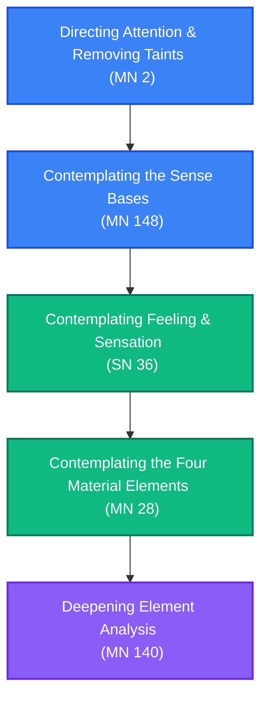

# Vipassanā Practice: Insight Meditation Path

**Navigation**: [[INDEX|Pali Canon Vault]] / [[paths/INDEX|Reading Paths]]

> [!NOTE]
> This reading path is designed to broaden insight practice beyond mindfulness of breathing and body posture, introducing structured frameworks for contemplating the sense bases, the feelings, the material elements, and the destruction of the mental taints.

---

## The Path Map

---

## 1. Orientation: Removing the Taints
Establishing the right mental orientation and methods for guarding the mind against defilements.

*   **[[mn2|MN 2: Sabbāsavasutta]]**  
    *Practice Focus*: The seven methods for abandoning the taints (*āsavas*): seeing, restraining, using, enduring, avoiding, removing, and developing. Helps the practitioner build a comprehensive strategy for mental purity.  
    *Commentaries*: [[mn2_att|Commentary]] · [[mn2_tik|Sub-commentary]]

---

## 2. Framework: The Sense Bases
Contemplating the experience of the six senses to dismantle the illusion of a permanent self.

*   **[[mn148|MN 148: Chachakkasutta]]**  
    *Practice Focus*: The "Six Sets of Six." A highly analytical discourse tracking the path of sense experience: eye, forms, eye-consciousness, eye-contact, feeling, and craving. Contemplating all 36 factors as impermanent, suffering, and not-self.  
    *Commentaries*: [[mn148_att|Commentary]] · [[mn148_tik|Sub-commentary]]

---

## 3. Entry Point: Contemplation of Feeling
Contemplating feeling (*vedanā*) to break the chain of dependent origination before it leads to craving.

*   **[[sn36|SN 36: Vedanāsaṃyutta]]**  
    *Practice Focus*: Feeling as an entry point for insight.
    *   **SN 36.6 (Sallatthasutta)**: Explains the difference between the physical dart of pain and the mental dart of reaction, urging the practitioner to feel pain without suffering.
    *   **SN 36.11 (Rahogatasutta)**: Describes the progressive quietude and cessation of feelings through the jhānas and formless attainments.
    *   **SN 36.21 (Sīvakasutta)**: Explains that not all experiences are the result of past kamma, dismantling fatalism.  
    *Commentaries*: [[sn36_att|Commentary]] · [[sn36_tik|Sub-commentary]]

---

## 4. Object: Contemplating the Material Elements
Contemplating the body not as a solid entity, but as a temporary assembly of material elements.

*   **[[mn28|MN 28: Mahāhatthipadopamasutta]]**  
    *Practice Focus*: The four elements (earth, water, fire, wind). Sāriputta describes how the external elements change and decay, prompting the practitioner to contemplate the internal elements as impermanent, not-self, and free from clinging.  
    *Commentaries*: [[mn28_att|Commentary]] · [[mn28_tik|Sub-commentary]]
*   **[[mn140|MN 140: Dhātuvibhaṅgasutta]]**  
    *Practice Focus*: The six elements (adding space and consciousness). The Buddha instructs Pukkusāti on element analysis, resolving into equanimity and the realization of final peace.  
    *Commentaries*: [[mn140_att|Commentary]] · [[mn140_tik|Sub-commentary]]

---

> [!TIP]
> For the core satipaṭṭhāna source texts, see [[mn10|MN 10: Satipaṭṭhānasutta]] and the [[four_foundations_of_mindfulness|Four Foundations of Mindfulness Mātikā]].
