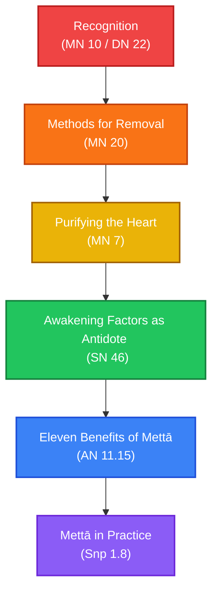

# Working with Anger and Ill Will

**Navigation**: [[INDEX|Pali Canon Vault]] / [[paths/INDEX|Reading Paths]]

> [!NOTE]
> Ill will (*vyāpāda*) — from irritation to full rage — is one of the five hindrances and one of the three unwholesome roots. The canon approaches it on three levels: **recognition** (seeing it arise without being swept away), **removal** (methods for releasing it when it has arisen), and **transformation** (cultivating loving-kindness and compassion as the mind's natural alternative). This path moves through all three.

---

## The Path Map

---

## 1. Recognition: Seeing Ill Will as a Hindrance

The first step is learning to recognize ill will as a mental event — something arising in the mind — rather than as the truth about the person or situation.

*   **[[mn10|MN 10: Satipaṭṭhānasutta]]** / **[[dn22|DN 22: Mahāsatipaṭṭhānasutta]]**  
    *Practice Focus*: In the section on contemplating mind-states (*cittānupassanā*), the practitioner knows when a mind with aversion (*sadosaṃ vā cittaṃ*) is present. In the section on mental objects (*dhammānupassanā*), ill will is named as the second of the five hindrances. The text describes recognizing its arising, its passing away, and how it does not arise in one who has abandoned it.  
    *Commentaries*: [[mn10_att|Commentary]] · [[mn10_tik|Sub-commentary]]

---

## 2. Methods for Removal: Releasing Unwanted Thoughts

When recognition fails and the mind has already been captured by aversion, the Buddha teaches five graduated methods for releasing it.

*   **[[mn20|MN 20: Vitakkasaṇṭhānasutta]]**  
    *Practice Focus*: The five methods — replacing the thought with its opposite (*paṭipakkha*), seeing its danger, not attending to it, stilling its formation, and crushing mind with mind — are applied to thoughts of ill will (*byāpāda*) along with sensual desire and harmfulness. The sutta ends with a simile of a skilled carpenter using a fine peg to drive out a rough one.  
    *Commentaries*: [[mn20_att|Commentary]] · [[mn20_tik|Sub-commentary]]

---

## 3. Purifying the Heart: Ill Will as a Defilement

The Vatthūpamasutta uses a direct and unsparing list of sixteen mental impurities — ill will is number five — and explains that just as a cloth must be clean to take dye, the mind must be free of these to receive the Dhamma. The antidote offered is the four brahmavihārā.

*   **[[mn7|MN 7: Vatthūpamasutta]]**  
    *Practice Focus*: The simile of the dirty cloth makes clear that a mind with ill will cannot attain liberation any more than dirty cloth can hold color. After confessing each impurity, the practitioner cultivates the four brahmavihārā — loving-kindness, compassion, appreciative joy, equanimity — pervading all directions.  
    *Commentaries*: [[mn7_att|Commentary]] · [[mn7_tik|Sub-commentary]]

---

## 4. Awakening Factors as Antidote: Joy and Compassion

The Bojjhaṅgasaṃyutta teaches how to work with the awakening factors (*bojjhaṅgā*) situationally. When the mind is sluggish, energizing factors are applied; when agitated, calming factors are applied. Ill will and cruelty are specifically countered by the brahmavihārā.

*   **[[sn46|SN 46: Bojjhaṅgasaṃyutta]]**  
    *Practice Focus*: Several suttas describe loving-kindness (*mettā*), compassion (*karuṇā*), and equanimity (*upekkhā*) as direct remedies when the mind is afflicted by ill will and cruelty. The awakening factor of joy (*pīti-sambojjhaṅga*) is particularly relevant: it is impossible for a mind saturated with genuine joy to simultaneously sustain aversion.  
    *Commentaries*: [[sn46_att|Commentary]] · [[sn46_tik|Sub-commentary]]

---

## 5. Eleven Benefits: What Mettā Actually Does

This sutta provides the most direct canonical account of what happens when loving-kindness practice matures — moving from mundane benefits (sleeping well, waking peacefully, being beloved by humans and animals) through to liberation.

*   **[[an11_15|AN 11.15: Mettānisaṃsasutta]]**  
    *Practice Focus*: The eleven fruits of mettā bhāvanā are enumerated: sleeping comfortably, waking comfortably, not seeing bad dreams, being dear to humans and non-humans, protected by devas, unharmed by fire and poison, concentrating quickly, dying without confusion, and — if not penetrating higher — reborn in a Brahmā-world. This gives the practitioner a clear picture of the trajectory.  
    *Commentaries*: [[an11_15_att|Commentary]] · [[an11_15_tik|Sub-commentary]]

---

## 6. Mettā in Practice: The Canonical Formula

The Metta Sutta is the canonical mettā practice text — the aspiration, the scope (all beings without exception), and the "divine abiding" (*brahmavihāra*) as the fruit.

*   **[[snp1_8|Snp 1.8: Karaṇīyamettasutta]]**  
    *Practice Focus*: The text begins with the requisite virtues for mettā practice, then gives the meditation instruction: extending goodwill "as a mother would protect her only child with her own life." The radiation is boundless — above, below, across — without obstruction, hatred, or enmity. This is read and chanted; the Pali is worth memorizing for use in formal practice.  
    *Commentaries*: [[snp1_8_att|Commentary]]

---

> [!TIP]
> For the brahmavihāra as a complete path (including brahmavihāra and jhāna), see the [[brahmavihara_cultivation|Brahmavihāra Cultivation path]]. For ill will as one of the three unwholesome roots, see [[three_unwholesome_roots]]. For the five hindrances as a complete framework, see [[working_with_hindrances|Working with the Five Hindrances path]].
