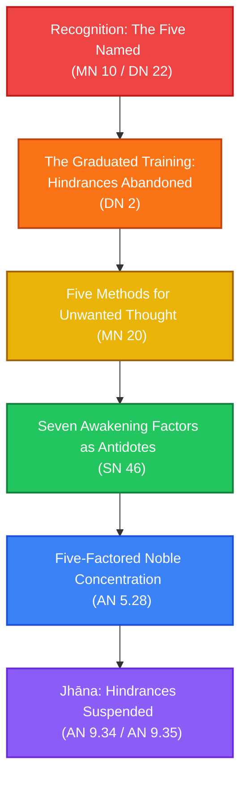

# Working with the Five Hindrances

**Navigation**: [[INDEX|Pali Canon Vault]] / [[paths/INDEX|Reading Paths]]

> [!NOTE]
> The five hindrances (*pañca nīvaraṇāni*) — sensual desire, ill will, sloth-and-torpor, restlessness-and-worry, and doubt — are the canonical account of what prevents the mind from settling into concentration and clarity. They are not obscure theory: every meditator encounters them on the cushion. This path moves from recognition through the graduated training, through targeted methods for each hindrance, through the antidote system of the awakening factors, and finally into the samādhi that arises when they are temporarily subdued.

---

## The Path Map

---

## 1. Recognition: The Five Named and Known

The Satipaṭṭhānasutta gives the canonical description of how to work with the hindrances through bare recognition — seeing each one as arising, persisting, and passing away, and knowing the conditions for its non-arising.

*   **[[mn10|MN 10: Satipaṭṭhānasutta]]** / **[[dn22|DN 22: Mahāsatipaṭṭhānasutta]]**  
    *Practice Focus*: In the *dhammānupassanā* section, the five hindrances are treated one by one. For each, the practitioner knows: "There is sensual desire in me" or "There is no sensual desire in me" — and knows how an unarisen hindrance arises, how an arisen one is abandoned, and how an abandoned one does not arise again. This is the meditation-hall application: recognition without suppression or reaction.  
    *Commentaries*: [[mn10_att|Commentary]] · [[mn10_tik|Sub-commentary]]

---

## 2. The Graduated Training: Hindrances Abandoned at a Stage

In the gradual training (*anupubbasikkhā*), abandoning the five hindrances is a specific milestone — not a final attainment, but the step that makes *jhāna* possible. The Sāmaññaphalasutta presents the classic description of this transition.

*   **[[dn2|DN 2: Sāmaññaphalasutta]]**  
    *Practice Focus*: The practitioner, having guarded the sense doors and established mindfulness, sits and reviews the mind. The hindrances are compared to debt, illness, imprisonment, slavery, and a desert journey — each simile conveying the relief of their abandonment. When the five hindrances are subdued, *pīti* (joy) and *sukha* (pleasure) arise naturally, and the first jhāna follows. This is the canonical "before and after" picture.  
    *Commentaries*: [[dn2_att|Commentary]] · [[dn2_tik|Sub-commentary]]

---

## 3. Five Methods: When a Hindrance Has Already Arisen

MN 20 is the canonical troubleshooting guide. When a hindrance has already captured the mind, the Buddha gives five graduated methods — from replacing the object of attention through to forcibly crushing mind with mind.

*   **[[mn20|MN 20: Vitakkasaṇṭhānasutta]]**  
    *Practice Focus*: The five methods — (1) directing attention to a wholesome sign, (2) reflecting on the danger of the unwholesome thought, (3) not attending to it at all, (4) attending to the stilling of its thought-formation, and (5) crushing mind with mind — are applied to thoughts of sensual desire, ill will, and harmfulness. The carpenter simile (fine peg drives out rough peg) illustrates method 1. The fifth method is the last resort for a mind that remains captive despite the first four.  
    *Commentaries*: [[mn20_att|Commentary]] · [[mn20_tik|Sub-commentary]]

---

## 4. Awakening Factors as Antidotes: A Situational System

The Bojjhaṅgasaṃyutta teaches how the seven awakening factors work in relationship to each other — and specifically how certain factors are the direct antidotes to specific hindrances. Sloth-and-torpor calls for the energizing factors; restlessness calls for the calming factors.

*   **[[sn46|SN 46: Bojjhaṅgasaṃyutta]]**  
    *Practice Focus*: Key suttas describe: (1) the awakening factor of *investigation of phenomena* (*dhammavicaya*) as the antidote to sloth-and-torpor; (2) the calming factors (*passaddhi*, *samādhi*, *upekkhā*) as antidotes to restlessness and worry; (3) *pīti* and *viriya* as antidotes to doubt and sluggishness; (4) loving-kindness and compassion as antidotes to ill will and cruelty. The system is functional: you apply the factor that is the direct opposite of what is present.  
    *Commentaries*: [[sn46_att|Commentary]] · [[sn46_tik|Sub-commentary]]

---

## 5. Five-Factored Concentration: The Other Side of the Equation

If the five hindrances describe what *obstructs* samādhi, the Pañcaṅgikasutta describes what samādhi *is* when the hindrances are absent. The five jhāna factors — applied thought, sustained thought, joy, pleasure, and one-pointedness — are directly opposed to the five hindrances.

*   **[[an5_28|AN 5.28: Pañcaṅgikasutta]]**  
    *Practice Focus*: The five jhāna factors (*vitakka, vicāra, pīti, sukha, ekaggatā*) are described as the "five-factored noble right concentration." The commentary aligns each jhāna factor with the hindrance it overcomes: *vitakka* (applied thought) opposes sloth-and-torpor; *vicāra* (sustained thought) opposes doubt; *pīti* (joy) opposes ill will; *sukha* (pleasure) opposes restlessness; *ekaggatā* (unification) opposes sensual desire. Seeing this map transforms the experience of hindrances during practice.  
    *Commentaries*: [[an5_28_att|Commentary]] · [[an5_28_tik|Sub-commentary]]

---

## 6. Jhāna: What Remains When Hindrances Are Suspended

These two short suttas describe the experience of jhāna in terms that are the direct negative of the hindrances: bliss arises because the burdens are set down. They are brief, lyrical, and worth reading after practice.

*   **[[an9_34|AN 9.34: Nibbānasukhasutta]]** · **[[an9_35|AN 9.35: Gāvīupamāsutta]]**  
    *Practice Focus*: AN 9.34 uses the image of someone who has set down a heavy burden — the burden of the hindrances — and knows the relief of nibbāna as the highest happiness. AN 9.35 uses the cow-and-pasture simile: a cow that wanders at will on all sides of a mountain will find no dearth of pasture — so too the practitioner who has abandoned the hindrances can range freely in all four directions of jhāna. These are post-session readings.  
    *Commentaries*: [[an9_34_att|Commentary]] · [[an9_34_tik|Sub-commentary]]

---

> [!TIP]
> For specific work with ill will (the second hindrance), see [[working_with_anger|Working with Anger and Ill Will]]. For the complete jhāna arc, see [[entering_jhana_path|Entering Jhāna path]]. The canonical list of five hindrances is at [[five_hindrances]].
